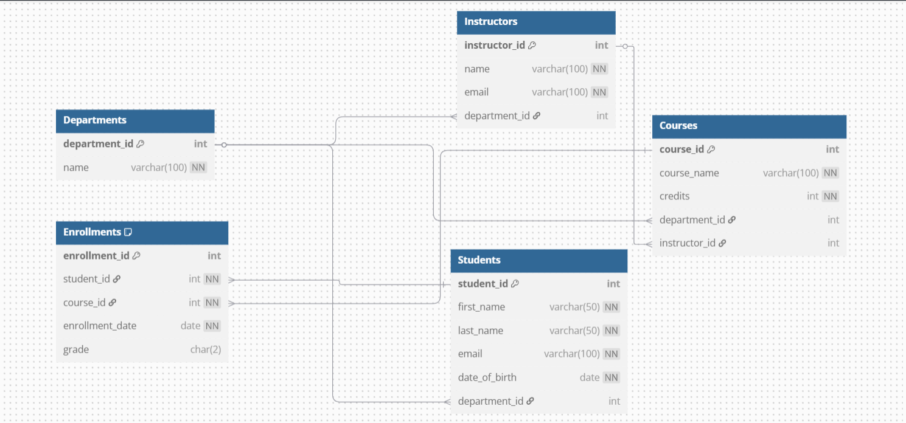

# 🎓 Student Records Management System

## 📋 Project Description

This project is a **Student Records Management System** built using **MySQL**. It is designed to manage student data, course enrollments, departments, and grades efficiently. The system allows for easy querying, updating, and organizing of academic records.

## 🚀 How to Run/Setup

1. **Clone the repository** or download the `.sql` file.
2. **Open MySQL Workbench** or your preferred MySQL client.
3. Run the following commands:

   ```sql
   -- Step 1: Create the database
   CREATE DATABASE StudentRecords;

   -- Step 2: Use the database
   USE StudentRecords;

   -- Step 3: Run the SQL script
   SOURCE path/to/your/script.sql;
   
## 📥 Import the SQL File

### ✅ Using MySQL Workbench

1. Open **MySQL Workbench** and connect to your MySQL server.
2. Select the `studentRecords` database from the left panel.
3. Go to **File > Open SQL Script** and choose the `.sql` file to import.
4. Click **Execute** (⚡️) to run the script.

### 🖥️ Using Command Line

```bash
mysql -u your_username -p studentRecords < path_to_the_sql_file.sql
```
## 🔍 Verify the Import

To ensure everything is set up correctly, you can run the following SQL commands:
```sql
   -- Step 1: Use the database
	USE StudentRecords;
			
   -- Step 2: Show tables the database
	SHOW TABLES;
```
## 🧑‍🏫 Project ERD

Below is the Entity Relationship Diagram (ERD) representing the structure of the `studentRecords` database.


